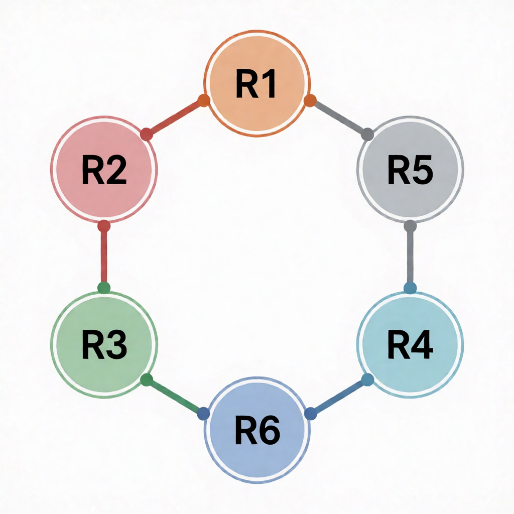

# Nornir Automation Lab

A practical laboratory environment demonstrating network automation workflows using [Nornir](https://nornir.tech/), the pluggable multi-threaded network automation framework written in Python.

## Overview

This repository provides a modular, lightweight environment for configuring and managing network devices with Nornir, for structured device grouping and provides runbooks for tasks executing like operational commands and pushing device configurations.

## Topology

---

## Prerequisites

- Python `3.12+`
- Virtual Environment
- [Netlab](https://netlab.tools/) or similar network lab environment

---

## Compatibility Notes

`requirements.txt` pins `paramiko<5.0` — paramiko 5.0 dropped the SHA-1 KEX algorithms and `ssh-rsa` support that legacy Cisco IOS still requires.

---

## External References

1. [GitHub Repository](https://github.com/nornir-automation/nornir)
2. [Nornir Documentation](https://nornir.readthedocs.io/en/latest/)
3. [Plugins List](https://nornir.readthedocs.io/en/latest/community/plugin_list.html)
